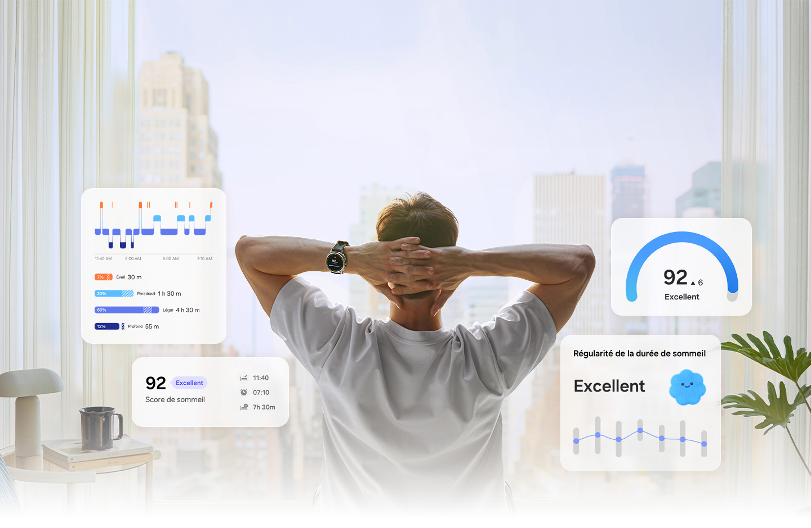
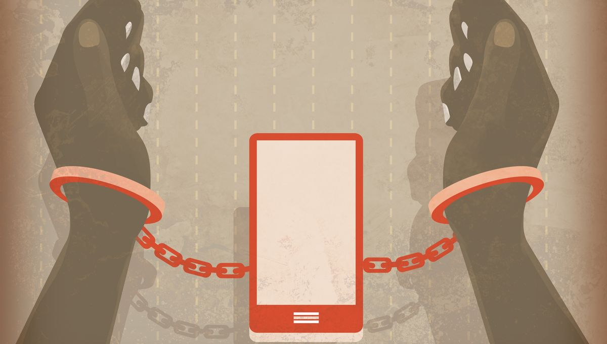
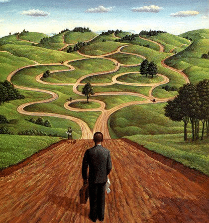

```{r setup, include=FALSE}
knitr::opts_chunk$set(echo = TRUE)
library(knitr)
library(tinytex)
```

```{r logo, echo=FALSE, out.width = '50%', fig.align = "center", fig.cap="Disponible à l'adresse https://www.global.surgery/fr/actualites/chirurgie-medecine-esthetique/biohacking-lausanne"}
knitr::include_graphics("biohacking.jpeg")
```

# Introduction

Il y a quelque temps, j'ai découvert sur YouTube une vidéo sur le biohacking [@tristan_je_2023,], un concept fascinant qui mêle science, technologie et art du vivant dans le but d'optimiser sa qualité de vie globale : santé physique, bien-être psychologique et performance intellectuelle. En tant que personne portant une attention particulière à ces trois dimensions de la santé, j'ai naturellement approfondi mes recherches sur le sujet.[@daniel_donhauser_biohacking_2024,]

J’ai rapidement constaté que les nouvelles technologies, les outils numériques, le biohacking et le bien-être sont aujourd'hui profondément entremêlés. Les applications de suivi, les objets connectés, l'intelligence artificielle et les données biométriques font aujourd'hui partie intégrante des stratégies d'optimisation personnelle.

Je me suis donc naturellement posé les questions suivantes : 

- **Comment améliorer sa santé physique, psychique et intellectuelle en conciliant mode de vie naturel et outils numériques ?**

- **Comment tirer parti de ces technologies dont nos ancêtres ne disposaient pas, en maximisant leurs bénéfices tout en minimisant leurs risques ?**

Ces problématique qui se rejoingent seront au cœur de ma recherche, explorant d'abord les liens entre bien-être et numérique, puis les pièges à éviter, avant de définir l'état d'esprit optimal à avoir selon moi.
 

# Partie 1 : Comment bien-être et outils numériques sont-ils liés ?


## L'émergence d'un écosystème technologique pour la santé

Depuis l’émergence d’internet, les nouvelles technologies se sont progressivement développées autour du bien-être, notamment à travers certaines périodes clés. D’abord avec les ordinateurs et le développement de la communication , les sciences comme la médecine, les statistiques et l'ingénierie ont pu mener des études plus approfondies dans la recherche de différents sujets impliquant de près ou de loin la santé (il est à noter que tout au long de ce document lorsque je parle de santé, j’inclue la santé physique, intellectuel et psychique), ensuite les smartphones, devenus omniprésents, ont ouvert la voie aux applications de santé et de bien-être. Les réseaux sociaux ont permis plus que jamais la circulation et l’échange de d’informations, les capteurs miniaturisés ont permis l'émergence des objets connectés portables tels que des montres ou encore des lits connectés. Tout cela combiné avec l'intelligence artificielle et nous avons désormais accès à des analyses personnalisées et des recommandations adaptées à chaque individu.[@andrew_steele_biohacking_2023,]

```{r logo2, echo=FALSE, out.width = '30%', fig.align = "center", fig.cap="Disponible à l'adresse https://www.samsung.com/fr/apps/samsung-health/"}

```

## Les trois piliers de cette connexion


### De la connaissance de soi à la lecture de données

Les technologies permettent aujourd'hui de quantifier et d'apporter des chiffres sur des aspects autrefois intuitifs de notre santé comme la qualité du sommeil, la variabilité cardiaque, notre niveau de stress, nos dépenses caloriques et même nos cycles hormonaux. Cette objectivation crée une nouvelle conscience de soi basée sur les données. On parle de "quantified self" ce sont tous ces outils et pratiques qui transforment le ressenti subjectif en données mesurables.[@cnil_question_nodate,]

### L'accompagnement et la motivation

Les outils numériques jouent un rôle de coach personnel accessible 24h/24. Applications de méditation guidée, programmes d'entraînement adaptés, rappels pour boire de l'eau ou se lever : la technologie crée une présence motivante et constante. Les mécanismes de gamification (défis, badges, statistiques) stimulent l'engagement dans des habitudes saines. De plus, le développement de communauté en ligne offre un soutien social.

### L'accès démocratisé à l'information et aux soins

Le numérique a révolutionné l'accès au savoir en santé. Tutoriels, recherches scientifiques vulgarisées, témoignages d'experts sont à portée de clic. La télémédecine brise les barrières géographiques. Les forums spécialisés permettent d'échanger sur des problématiques de santé spécifiques. Et depuis peu, l'IA peut fournir des pré-diagnostics ou orienter vers les bonnes ressources.


# Partie 2 : Comment ne pas tomber dans l'abrutissement et la dépendance ?

```{r logo3, echo=FALSE, out.width = '30%', fig.align = "right", fig.cap="Disponible à l'adresse https://www.radiofrance.fr/franceculture/podcasts/hashtag/je-me-sens-en-insecurite-sans-mon-telephone-4782332"}

```

## Les pièges de l'hyperconnexion santé

## La dépendance aux chiffres et la perte d'intuition

Paradoxalement, trop mesurer peut nous déconnecter de nos sensations corporelles naturelles. Certains utilisateurs deviennent incapables de savoir s'ils ont bien dormi sans consulter leur score de sommeil. La confiance dans les signaux du corps s'affaiblit au profit d'une dépendance aux données numériques. Cette dépendance peut même provoquer une anxiété quand les chiffres ou les graphiques ne correspondent pas aux attentes, même si le ressenti est bon.[@estelle_saget_sante_2025,]

### L'information abondante et la paralysie décisionnelle

Encore un phénomène paradoxal, l'abondance d'informations et de contradictions sur la santé crée un nouveau problème. Chaque source prétend détenir la vérité sur l'alimentation optimale, le meilleur exercice, le sommeil idéal. Cette surcharge informationnelle génère confusion et épuisement mental. Certains passent plus de temps à planifier leur santé qu'à la vivre réellement.


### La confiance et la délégation excessive à la machine et l'IA

S'en remettre entièrement aux machines présente des dangers. L'IA manque d’humanité, de nuances, de compréhension holistique. La machine porte moins de risque que l’IA car moins polyvalente donc moins susceptible de prendre le contrôle mais reste dangereuse pour notre libre arbitre et notre capacité à se débrouiller (plus d’approfondissement en conclusion). La désintellectualisation guette ceux qui cessent de réfléchir par eux-mêmes et suivent aveuglément les recommandations automatisées. [@didier_courbet_reseaux_2022,]


# Conclusion :  Quel serait l'état d'esprit à avoir selon moi ?

```{r logo4, echo=FALSE, out.width = '30%', fig.align = "right", fig.cap="Disponible à l'adresse https://commentjaichangedevie.fr/tu-veux-ou-tu-veux-pas/"}

```

## Stratégies pour un usage équilibré


### Pratiquer la déconnexion régulière
Instaurer des périodes sans mesure, sans tracking, sans consultation de données. Réapprendre à écouter son corps sans intermédiaire technologique. Faire confiance à ses sensations : ai-je vraiment besoin de savoir mon nombre de pas pour savoir si j'ai été actif aujourd'hui ?


### Utiliser la technologie comme outil, non comme maître

Les outils numériques doivent servir nos objectifs, pas devenir des fins en elles-mêmes. Si une application génère plus d'anxiété que de bénéfices, l'abandonner. Personnaliser son usage selon ses besoins réels, pas selon ce que la technologie propose. Garder le contrôle de la relation homme-machine. Avoir conscience et faire attention aux biais cognitifs que les entreprises peuvent utiliser pour nous faire acheter leurs produits comme le syndrome de FOMO (Fear Of Missing Out) ou l’effet de mode. [@didier_courbet_reseaux_2022,]

### Maintenir le contact humain

Ne pas remplacer les professionnels de santé par des applications. Privilégier la communication physique plutôt que virtuelle quand c'est possible. L'interaction humaine apporte empathie, nuance et adaptation que la technologie ne pourra jamais égaler.


## La philosophie de l'équilibre conscient


### L'hybridation intelligente

Vous l’aurez sûrement déjà compris, je pense que tout est une question d'équilibre, l'état d'esprit optimal n'est ni le rejet technophobe ni l'adoption béate de toute innovation. C'est une hybridation consciente et réfléchie entre approches naturelles et outils numériques. Utiliser un tracker pour affiner ce que l’on ressent, garder son esprit critique pour chaque résultat et améliorer sa débrouillardise en vérifiant et en remettant en cause , puis appliquer des solutions naturelles (exposition lumineuse, plantes adaptogènes, routines apaisantes). La technologie conseil, le corps diagnostique, la nature soigne.


## Vers une santé augmentée mais humaine

Ne pas oublier que toutes ces inventions et technologie qui nous apportent plus de confort ont été mises à notre disposition par des entreprise qui ont pour premier but de vendre et faire du profit. De plus, je pense que même avec toute la bienveillance du monde il nous est impossible d’égaler ce que nous donne la nature.
L'état d'esprit idéal pourrait se résumer ainsi : utiliser intelligemment les outils numériques pour amplifier notre potentiel naturel, sans perdre notre humanité et notre intuition qui nous ont permis d’évoluer.


# Ouverture : Vers le transhumanisme ?


En poussant la réflexion plus loin, je ne peux pas m’empêcher de penser au transhumanisme : une vision où le lien entre santé, vie, humain d'un côté, technologie machine de l'autre deviendrait si étroit qu'ils finiraient par fusionner entre eux. Cette perspective, à la fois fascinante et vertigineuse, m'a été révélée par des œuvres de science-fiction comme Akira ou Ghost in the Shell, qui explorent ces sujets et qui invite à se poser des questionnement profond

Ces fictions posent une question que le biohacking actuel commence à rendre concrète : jusqu'où peut-on aller dans l'optimisation et l'augmentation de soi ? Les implants pour oreilles rendent déjà l'ouïe aux sourds. Les prothèses bioniques dépassent parfois les performances des membres biologiques. Des puces RFID sont implantées pour ouvrir des portes ou payer ses achats. Où tracer la ligne entre thérapie et amélioration, entre soin et transformation ?[@katsuhiro_otomo_akira_1988,] [@masamune_shirow_ghost_1989,]


```{r logo5, echo=FALSE, out.width = '60%', fig.align = "center", fig.cap="Disponible à l'adresse https://www.sanctuary.fr/article/36161/"}

```

# Référence

## Iagraphie
Utilisation de Claude.ai pour la recherche de source et pour la correction de faute d'orthographe

## Bibliographie

